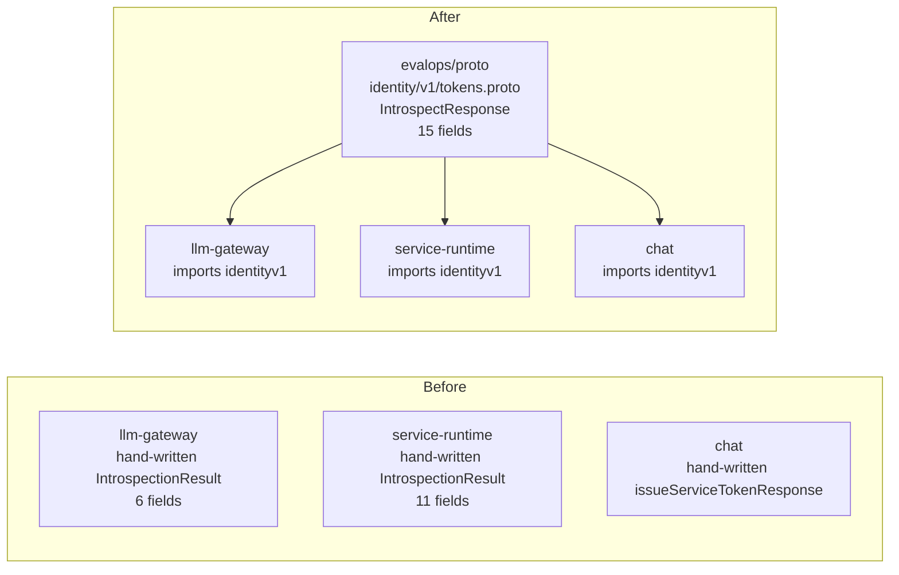

# Proto

`proto` is the canonical home for cross-service protobuf definitions in the
EvalOps ecosystem.

It holds `.proto` files for the shared contracts that multiple services depend
on, generates type-safe Go and TypeScript packages from those definitions, and
enforces schema compatibility through CI. Services import the generated
packages instead of maintaining their own hand-written struct copies.

## Goals

- Provide a single source of truth for cross-service API types.
- Generate Go, TypeScript, and Python packages from one set of definitions.
- Catch breaking contract changes at compile time, not in production.
- Keep wire encoding efficient with protobuf binary format.
- Support Connect-RPC service definitions for typed cross-service calls.

## Non-Goals

- This repo does not hold service-internal types that never cross a service boundary.
- This repo does not define the external REST/OpenAPI surface of any service.
- This repo does not own service implementation or business logic.
- This repo does not replace service-local proto definitions for internal RPC
  (e.g. gate's proxy protocol protos or chat's conversation streaming protos).

## Packages

| Package | Description | Consumers |
|---------|-------------|-----------|
| `identity/v1` | Token introspection, organizations, members, API keys, sessions | gate, chat, llm-gateway, service-runtime, identity |
| `keys/v1` | Managed provider refs, endpoint metadata, credential resolution | keys, llm-gateway, chat |
| `meter/v1` | Usage recording, querying, cost attribution | llm-gateway, chat, platform |
| `audit/v1` | Audit event recording, actors, resources, querying, export | llm-gateway, chat, gate, platform |
| `memory/v1` | Semantic memory storage, recall, embeddings, consolidation | chat, ensemble, platform |
| `agents/v1` | Agent definitions, versioned configuration, delegation protocol | registry, ensemble, chat, maestro, conductor, all surfaces |
| `approvals/v1` | Approval workflows, policies, decisions, habits, escalation | approvals, ensemble, maestro, chat, objectives |
| `config/v1` | Shared runtime config snapshots and feature-flag state | deploy, llm-gateway, maestro, gate |
| `connectors/v1` | Integration connections, health, source-of-truth, capabilities | connectors, pipeline, parker, entities, objectives |
| `entities/v1` | Canonical entity resolution, search, links, correlation graph | entities, pipeline, parker, connectors, ensemble |
| `governance/v1` | Safety evaluation, PII detection, retention, legal holds | governance, approvals, objectives, ensemble, chat |
| `notifications/v1` | Notification delivery, preferences, channels, status | notifications, approvals, objectives, pipeline, parker |
| `objectives/v1` | Objective lifecycle, wake scheduling, provenance, mutations | objectives, approvals, governance, pipeline, parker |
| `skills/v1` | Shared skill registry, versions, search, import/export | skills, chat, ensemble, maestro, pipeline |
| `events/v1` | Shared NATS event envelope and change journal payloads | service-runtime, pipeline, parker |
| `tap/v1` | Normalized tap webhook payloads and field-level diffs | siphon, pipeline |
| `workflows/v1` | Multi-agent workflow orchestration, DAG execution, compensation | objectives, ensemble, maestro, approvals, governance |
| `prompts/v1` | Prompt versioning, deployment tracking, eval linkage, resolution | prompts, llm-gateway, fermata, maestro, ensemble |
| `registry/v1` | Agent presence, capability discovery, heartbeat, capacity routing | registry, ensemble, chat, maestro, conductor |

## Architecture Diagrams

### Contract Ownership

```mermaid
flowchart TD
    Proto[evalops/proto]
    Identity[identity]
    Meter[meter]
    Audit[audit]
    Memory[memory]
    Approvals[approvals]
    Connectors[connectors]
    Entities[entities]
    Governance[governance]
    Notifications[notifications]
    Objectives[objectives]
    Skills[skills]
    Gateway[llm-gateway]
    Chat[chat]
    Gate[gate]
    Ensemble[ensemble]
    SRT[service-runtime]
    Registry[registry]
    Conductor[conductor]

    Proto -->|identity/v1| Identity
    Proto -->|identity/v1| Gateway
    Proto -->|identity/v1| Chat
    Proto -->|identity/v1| Gate
    Proto -->|identity/v1| SRT
    Proto -->|keys/v1| Keys[keys]
    Proto -->|keys/v1| Gateway
    Proto -->|keys/v1| Chat
    Proto -->|meter/v1| Meter
    Proto -->|meter/v1| Gateway
    Proto -->|meter/v1| Chat
    Proto -->|audit/v1| Audit
    Proto -->|audit/v1| Gateway
    Proto -->|audit/v1| Chat
    Proto -->|audit/v1| Gate
    Proto -->|memory/v1| Memory
    Proto -->|memory/v1| Chat
    Proto -->|memory/v1| Ensemble
    Proto -->|approvals/v1| Approvals
    Proto -->|approvals/v1| Chat
    Proto -->|approvals/v1| Ensemble
    Proto -->|approvals/v1| Objectives
    Proto -->|connectors/v1| Connectors
    Proto -->|connectors/v1| Pipeline
    Proto -->|connectors/v1| Parker
    Proto -->|connectors/v1| Entities
    Proto -->|entities/v1| Entities
    Proto -->|entities/v1| Pipeline
    Proto -->|entities/v1| Parker
    Proto -->|entities/v1| Ensemble
    Proto -->|governance/v1| Governance
    Proto -->|governance/v1| Approvals
    Proto -->|governance/v1| Objectives
    Proto -->|governance/v1| Chat
    Proto -->|notifications/v1| Notifications
    Proto -->|notifications/v1| Approvals
    Proto -->|notifications/v1| Objectives
    Proto -->|objectives/v1| Objectives
    Proto -->|objectives/v1| Approvals
    Proto -->|objectives/v1| Governance
    Proto -->|skills/v1| Skills
    Proto -->|skills/v1| Chat
    Proto -->|skills/v1| Ensemble
    Proto -->|skills/v1| Maestro[maestro]
    Proto -->|events/v1| SRT
    Proto -->|events/v1| Parker[Parker]
    Proto -->|events/v1| Pipeline[Pipeline]
    Proto -->|tap/v1| Siphon[siphon]
    Proto -->|tap/v1| Pipeline
    Proto -->|prompts/v1| Prompts[prompts]
    Proto -->|prompts/v1| Gateway
    Proto -->|prompts/v1| Fermata[fermata]
    Proto -->|prompts/v1| Maestro[maestro]
    Proto -->|prompts/v1| Ensemble
    Proto -->|agents/v1| Registry
    Proto -->|agents/v1| Ensemble
    Proto -->|agents/v1| Chat
    Proto -->|agents/v1| Maestro
    Proto -->|registry/v1| Registry
    Proto -->|registry/v1| Ensemble
    Proto -->|registry/v1| Chat
    Proto -->|registry/v1| Maestro
    Proto -->|workflows/v1| Objectives
    Proto -->|workflows/v1| Ensemble
    Proto -->|workflows/v1| Maestro
    Proto -->|workflows/v1| Approvals
    Proto -->|workflows/v1| Governance
```



### What This Replaces



## Usage

### Go

```go
import (
    agentsv1 "github.com/evalops/proto/gen/go/agents/v1"
    identityv1 "github.com/evalops/proto/gen/go/identity/v1"
    meterv1 "github.com/evalops/proto/gen/go/meter/v1"
    auditv1 "github.com/evalops/proto/gen/go/audit/v1"
    memoryv1 "github.com/evalops/proto/gen/go/memory/v1"
    promptsv1 "github.com/evalops/proto/gen/go/prompts/v1"
    registryv1 "github.com/evalops/proto/gen/go/registry/v1"
    workflowsv1 "github.com/evalops/proto/gen/go/workflows/v1"
)

// Use generated types directly
req := &meterv1.RecordUsageRequest{
    TeamId:       "team-platform",
    AgentId:      "agent_writer",
    Surface:      "maestro",
    EventType:    "llm.completion",
    Model:        "claude-opus-4.6",
    Provider:     "anthropic",
    InputTokens:  1250,
    OutputTokens: 340,
    TotalCostUsd: 0.0423,
    RequestId:    "req_789",
}

// Resolve the active prompt version at inference time
resolveReq := &promptsv1.ResolveRequest{
    Name:    "sdr-outreach",
    Surface: "ensemble",
    Env:     "production",
}
```

### Go with Connect-RPC

```go
import (
    meterv1connect "github.com/evalops/proto/gen/go/meter/v1/meterv1connect"
    "connectrpc.com/connect"
)

client := meterv1connect.NewMeterServiceClient(
    http.DefaultClient,
    "https://meter.internal",
)
resp, err := client.RecordUsage(ctx, connect.NewRequest(req))
```

### TypeScript

```typescript
import { RecallRequest } from "@evalops/proto/memory/v1/memory_pb";
import { CloudEventSchema } from "@evalops/proto/events/v1/cloudevent_pb";
```

### TypeScript Package

`proto` also publishes the generated TypeScript contract surface from the repo
root as `@evalops/proto`.

Current package surface:

- protobuf-es message modules like `@evalops/proto/memory/v1/memory_pb`
- managed provider-ref contracts like `@evalops/proto/keys/v1/keys_pb`
- metering contracts like `@evalops/proto/meter/v1/meter_pb`
- shared event contracts like `@evalops/proto/events/v1/cloudevent_pb`
- agent contracts like `@evalops/proto/agents/v1/agents_pb`
- registry contracts like `@evalops/proto/registry/v1/registry_pb`
- workflow contracts like `@evalops/proto/workflows/v1/workflows_pb`

The generated `_connect` descriptors remain checked into the repo, but the
published package currently exports the stable `_pb` modules only. That keeps
the registry surface aligned with the protobuf-es runtime shape we validate in
CI today.

CI validates the package on pull requests, and the `NPM Publish` workflow packs
and publishes it automatically on `main` when Artifact Registry or
`NPM_PUBLISH_NPMRC` publish credentials are configured. The package check is
driven from the built `gen/dist/**/*_pb.js` tree, so new generated modules have
to be exported explicitly instead of silently skipping package validation.

### Python Package

`proto` now also commits generated Python protobuf modules under `gen/python`
and builds a wheel from that tree in CI. That gives Python consumers a stable
artifact path for local sync or packaging checks without forcing every repo to
run `buf generate` itself.

Local usage from the checked-in generated tree looks like:

```bash
PYTHONPATH=gen/python python - <<'PY'
from config.v1.config_pb2 import FeatureFlagSnapshot
from events.v1.cloudevent_pb2 import CloudEvent

print(FeatureFlagSnapshot.__name__, CloudEvent.__name__)
PY
```

The wheel build uses the same generated modules and smoke-imports them in CI, so
Python contract drift now fails closed the same way the Go and TypeScript
surfaces do. Package discovery is driven from the generated `gen/python` tree
itself, which keeps new protobuf packages from being silently omitted from the
published wheel as the schema surface grows.

## Event Envelope Guidance

`events/v1.CloudEvent` is the canonical typed envelope for the shared internal
bus.

- Set `subject` to the actual bus subject when the transport has one. This
  keeps NATS routing context visible without forcing consumers to infer it from
  `type`.
- Keep `data` as a typed message packed in `google.protobuf.Any`; do not fall
  back to service-local ad hoc payload blobs.
- Prefer `data_content_type=application/protobuf` for the canonical envelope.
  Some services still emit structured CloudEvents JSON with
  `specversion`/`datacontenttype` and JSON `data` while they migrate. Consumers
  should tolerate both shapes until the bus converges, but new typed contracts
  should start from `events/v1.CloudEvent`.
- Use `github.com/evalops/proto/eventhelpers` to build and unpack canonical
  envelopes instead of re-implementing `Any` packing, protojson marshaling, and
  type assertions in each service. The package exports `NewCloudEvent`,
  `NewChange`, `MarshalProtoJSON`, `UnpackChange`,
  `UnpackEvaluationCompleted`, and `UnpackTapEventData`. `NewCloudEvent` also stamps
  `extensions.dataschema=buf.build/evalops/proto/<message>` so published
  envelopes stay self-describing across service boundaries.
- Use `config/v1.FeatureFlagSnapshot` when a repo needs a shared on-disk or
  over-the-wire representation for lightweight runtime config or feature flags.
  The initial production deploy bundle publishes that schema as canonical
  protojson instead of a repo-local YAML shape.

## MCP Tool Descriptions

`descriptions.yaml` in the repo root maps every RPC operation ID to a
human-readable description for agent-facing MCP tool surfaces. When platform
services are exposed through `mcp-openapi`, these descriptions tell agents what
each tool does, when to use it, and what to expect.

```bash
mcp-openapi --spec platform.openapi.yaml --descriptions descriptions.yaml
```

Maintain this file alongside the proto definitions. When a new RPC is added,
add its description in the same PR.

## Development

Prerequisites:

- [buf](https://buf.build/docs/installation) v1.50+
- Go 1.22+

```bash
# Lint proto files
make lint

# Check for breaking changes against main
make breaking

# Regenerate Go, TypeScript, and Python packages
make generate

# Run contract tests for generated packages
make test

# Clean and regenerate from scratch
make clean generate
```

Fixture-backed contract examples live alongside the owning proto package under
`proto/<service>/v1/testdata/`. Keep those JSON examples aligned with the
canonical protojson field names because `make test` unmarshals them through the
generated types.

High-risk boundary fixtures belong there too. The current catalog includes
canonical `events/v1.CloudEvent` examples for `pipeline.changes.activity.create`
with `outcome=replied`, `pipeline.changes.signal.create` with
`signal_type=linkedin_active`, `pipeline.changes.deal.update` with
`stage=closed_won`, and `parker.changes.work_relationship.update` with
`status=terminated`, plus `evaluation.completed` with a typed
`events/v1.EvaluationCompleted` payload for the Fermata -> Pipeline capability
signal seam. It also includes a Tap -> Pipeline boundary fixture for
`siphon.hubspot.deal.updated` with a qualified stage change and a real
UUID tenant, so downstream consumers can pin the semantics they depend on
instead of only the wire shape.

Go consumers can import those fixtures directly from
`github.com/evalops/proto/contractfixtures` instead of copying JSON into each
repo. For example, `contractfixtures.Read(contractfixtures.EventPipelineActivityCreateReplied)`
returns the canonical protojson fixture bytes that service-side tests can decode
and compare against their own publisher or consumer behavior.

For typed helpers, use `contractfixtures.LoadChangeFixture(...)` or
`contractfixtures.LoadTapFixture(...)` to unpack the canonical
`events/v1.CloudEvent` envelope and its typed payload in one call.

## Adding a New Proto

1. Create `proto/<service>/v1/<file>.proto`.
2. Set the Go package option:
   ```protobuf
   option go_package = "github.com/evalops/proto/gen/go/<service>/v1;<service>v1";
   ```
3. Run `make lint` to validate.
4. Run `make generate` to produce Go and TypeScript packages.
5. Commit the `.proto` file and generated code together.
6. After merge, consumers can import the new package immediately.

## Adding a Breaking Change

`buf breaking` runs on every PR against `main`. If your change breaks wire
compatibility (renaming a field, changing a field number, removing a field),
the PR will fail CI.

To make a safe change:

- Add new fields with new field numbers. Old consumers ignore unknown fields.
- Deprecate fields with `[deprecated = true]` instead of removing them.
- If a field must be removed, reserve its number: `reserved 5;`

## Repository Layout

```text
buf.yaml                buf module configuration
buf.gen.yaml            codegen plugin configuration
proto/                  source .proto files
  identity/v1/          token introspection, orgs, members, sessions
  keys/v1/              managed provider refs and credential resolution
  meter/v1/             usage recording and cost attribution
  audit/v1/             audit event recording and querying
  memory/v1/            semantic memory storage and recall
    testdata/           canonical protojson fixtures for contract tests
  agents/v1/            agent definitions, config versioning, delegation
  approvals/v1/         approval workflows, policies, decisions, habits
  config/v1/            runtime config snapshots and feature-flag state
  connectors/v1/        integration lifecycle, health, source-of-truth
  entities/v1/          canonical entity resolution and search
  governance/v1/        safety evaluation, PII detection, retention
  notifications/v1/     multi-channel delivery, preferences, status
  objectives/v1/        objective lifecycle, provenance, wake scheduling
  skills/v1/            shared skill registry and version history
  events/v1/            CloudEvent envelope and change journal payloads
    testdata/           typed event fixtures for cross-service contracts
  tap/v1/               normalized provider event payloads
  workflows/v1/         multi-agent workflow orchestration, DAG execution
  prompts/v1/           prompt versioning, deployment, eval linkage
  registry/v1/          agent presence, capability discovery, heartbeat
gen/                    generated code (committed)
  go/                   Go protobuf + Connect-RPC packages
  ts/                   TypeScript protobuf-es + Connect-ES packages
  python/               Python protobuf packages
.github/workflows/      CI: lint, breaking, generate, build
```

## CI

The CI pipeline runs on every push to `main` and every PR:

1. `buf lint` — validates proto files against the STANDARD rule set.
2. `buf breaking` — checks for wire-incompatible changes against `main` (PRs only).
3. `buf generate` — regenerates code and fails if the committed code is stale.
4. `go test` — verifies the generated Go packages and contract tests pass.
5. `python-package` — builds and smoke-installs the generated Python wheel.

## Related Issues

- evalops/proto#1 — bootstrap tracking issue
- evalops/platform#9110 — cross-service protobuf coordination
- evalops/identity#56 — adopt identity proto types
- evalops/meter#30 — adopt meter proto types
- evalops/audit#23 — adopt audit proto types
- evalops/memory#32 — adopt memory proto types
- evalops/service-runtime#24 — shared protobuf event schemas
- evalops/proto#38 — adopt agents/v1 in registry
- evalops/proto#39 — adopt workflows/v1 in objectives
