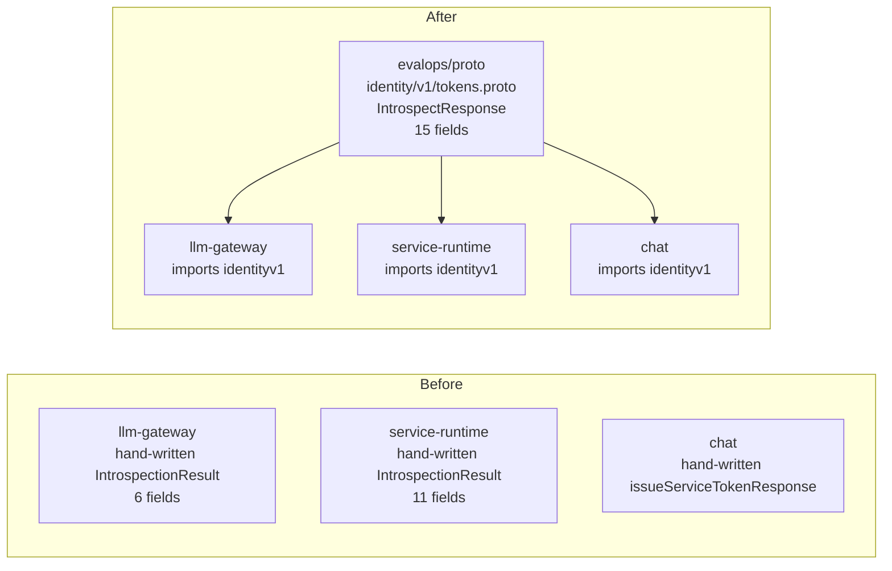

# Proto

`proto` is the canonical home for cross-service protobuf definitions in the
EvalOps ecosystem.

It holds `.proto` files for the shared contracts that multiple services depend
on, generates type-safe Go and TypeScript packages from those definitions, and
enforces schema compatibility through CI. Services import the generated
packages instead of maintaining their own hand-written struct copies.

## Goals

- Provide a single source of truth for cross-service API types.
- Generate Go, TypeScript, and Python packages from one set of definitions.
- Catch breaking contract changes at compile time, not in production.
- Keep wire encoding efficient with protobuf binary format.
- Support Connect-RPC service definitions for typed cross-service calls.

## Non-Goals

- This repo does not hold service-internal types that never cross a service boundary.
- This repo does not define the external REST/OpenAPI surface of any service.
- This repo does not own service implementation or business logic.
- This repo does not replace service-local proto definitions for internal RPC
  (e.g. gate's proxy protocol protos or chat's conversation streaming protos).

## Packages

| Package | Description | Consumers |
|---------|-------------|-----------|
| `identity/v1` | Token introspection, organizations, members, API keys, sessions | gate, chat, llm-gateway, service-runtime, identity |
| `meter/v1` | Usage recording, querying, cost attribution | llm-gateway, chat, platform |
| `audit/v1` | Audit event recording, actors, resources, querying, export | llm-gateway, chat, gate, platform |
| `memory/v1` | Semantic memory storage, recall, embeddings, consolidation | chat, ensemble, platform |
| `events/v1` | Shared NATS event envelope and change journal payloads | service-runtime, pipeline, parker |
| `tap/v1` | Normalized tap webhook payloads and field-level diffs | ensemble-tap, pipeline |

## Architecture Diagrams

### Contract Ownership

```mermaid
flowchart TD
    Proto[evalops/proto]
    Identity[identity]
    Meter[meter]
    Audit[audit]
    Memory[memory]
    Gateway[llm-gateway]
    Chat[chat]
    Gate[gate]
    Ensemble[ensemble]
    SRT[service-runtime]

    Proto -->|identity/v1| Identity
    Proto -->|identity/v1| Gateway
    Proto -->|identity/v1| Chat
    Proto -->|identity/v1| Gate
    Proto -->|identity/v1| SRT
    Proto -->|meter/v1| Meter
    Proto -->|meter/v1| Gateway
    Proto -->|meter/v1| Chat
    Proto -->|audit/v1| Audit
    Proto -->|audit/v1| Gateway
    Proto -->|audit/v1| Chat
    Proto -->|audit/v1| Gate
    Proto -->|memory/v1| Memory
    Proto -->|memory/v1| Chat
    Proto -->|memory/v1| Ensemble
    Proto -->|events/v1| SRT
    Proto -->|events/v1| Parker[Parker]
    Proto -->|events/v1| Pipeline[Pipeline]
    Proto -->|tap/v1| EnsembleTap[ensemble-tap]
    Proto -->|tap/v1| Pipeline
```



### What This Replaces



## Usage

### Go

```go
import (
    identityv1 "github.com/evalops/proto/gen/go/identity/v1"
    meterv1 "github.com/evalops/proto/gen/go/meter/v1"
    auditv1 "github.com/evalops/proto/gen/go/audit/v1"
    memoryv1 "github.com/evalops/proto/gen/go/memory/v1"
)

// Use generated types directly
req := &meterv1.RecordUsageRequest{
    OrganizationId: orgID,
    Model:          "claude-opus-4.6",
    PromptTokens:   1250,
    CostMicros:     42300,
}
```

### Go with Connect-RPC

```go
import (
    meterv1connect "github.com/evalops/proto/gen/go/meter/v1/meterv1connect"
    "connectrpc.com/connect"
)

client := meterv1connect.NewMeterServiceClient(
    http.DefaultClient,
    "https://meter.internal",
)
resp, err := client.RecordUsage(ctx, connect.NewRequest(req))
```

### TypeScript

```typescript
import { RecallRequest } from "@evalops/proto/memory/v1/memory_pb";
import { createClient } from "@connectrpc/connect-web";
import { MemoryService } from "@evalops/proto/memory/v1/memory_connect";
```

## Development

Prerequisites:

- [buf](https://buf.build/docs/installation) v1.50+
- Go 1.22+

```bash
# Lint proto files
make lint

# Check for breaking changes against main
make breaking

# Regenerate Go and TypeScript packages
make generate

# Run contract tests for generated packages
make test

# Clean and regenerate from scratch
make clean generate
```

## Adding a New Proto

1. Create `proto/<service>/v1/<file>.proto`.
2. Set the Go package option:
   ```protobuf
   option go_package = "github.com/evalops/proto/gen/go/<service>/v1;<service>v1";
   ```
3. Run `make lint` to validate.
4. Run `make generate` to produce Go and TypeScript packages.
5. Commit the `.proto` file and generated code together.
6. After merge, consumers can import the new package immediately.

## Adding a Breaking Change

`buf breaking` runs on every PR against `main`. If your change breaks wire
compatibility (renaming a field, changing a field number, removing a field),
the PR will fail CI.

To make a safe change:

- Add new fields with new field numbers. Old consumers ignore unknown fields.
- Deprecate fields with `[deprecated = true]` instead of removing them.
- If a field must be removed, reserve its number: `reserved 5;`

## Repository Layout

```text
buf.yaml                buf module configuration
buf.gen.yaml            codegen plugin configuration
proto/                  source .proto files
  identity/v1/          token introspection, orgs, members, sessions
  meter/v1/             usage recording and cost attribution
  audit/v1/             audit event recording and querying
  memory/v1/            semantic memory storage and recall
  events/v1/            CloudEvent envelope and change journal payloads
  tap/v1/               normalized provider event payloads
gen/                    generated code (committed)
  go/                   Go protobuf + Connect-RPC packages
  ts/                   TypeScript protobuf-es + Connect-ES packages
.github/workflows/      CI: lint, breaking, generate, build
```

## CI

The CI pipeline runs on every push to `main` and every PR:

1. `buf lint` — validates proto files against the STANDARD rule set.
2. `buf breaking` — checks for wire-incompatible changes against `main` (PRs only).
3. `buf generate` — regenerates code and fails if the committed code is stale.
4. `go test` — verifies the generated Go packages and contract tests pass.

## Related Issues

- evalops/proto#1 — bootstrap tracking issue
- evalops/platform#9110 — cross-service protobuf coordination
- evalops/identity#56 — adopt identity proto types
- evalops/meter#30 — adopt meter proto types
- evalops/audit#23 — adopt audit proto types
- evalops/memory#32 — adopt memory proto types
- evalops/service-runtime#24 — shared protobuf event schemas
